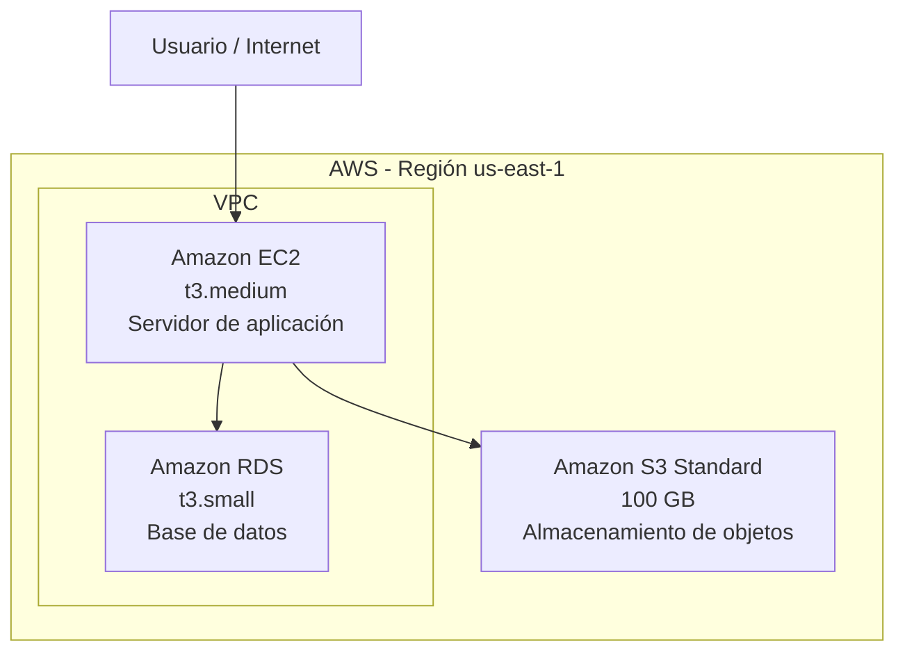

# Evaluación Parcial 1: Servicios, infraestructura y gestión de costos en la nube

**Asignatura:** Soluciones Cloud  
**Sigla:** CCY0010  
**Estudiante:** [NOMBRE COMPLETO]  
**Docente:** [NOMBRE DEL DOCENTE]  
**Sección:** [SECCIÓN]  
**Fecha:** [FECHA DE ENTREGA]  

> **Estado del documento:** borrador de trabajo. Antes de entregar se deben reemplazar los campos entre corchetes, agregar las capturas reales de AWS Pricing Calculator, el enlace público de la estimación y los valores finales de costos.

---

## 1. Descripción de la solución

Para esta evaluación se propone una solución utilizando servicios de Amazon Web Services (AWS). La arquitectura está compuesta por recursos de cómputo, base de datos y almacenamiento, siguiendo los requerimientos indicados en la pauta.

Para la parte de cómputo se utiliza una instancia **Amazon EC2 t3.medium**, que cumple la función de servidor para ejecutar la aplicación. Para almacenar y administrar los datos estructurados se utiliza una instancia **Amazon RDS t3.small**. Finalmente, se consideran **100 GB de Amazon S3 Standard** para guardar archivos u objetos que necesite la solución.

El costo mensual de estos recursos se calculará utilizando **AWS Pricing Calculator**. En la estimación se deben configurar exactamente los recursos solicitados y utilizar las iniciales del estudiante en el nombre o descripción de cada servicio.

### 1.1 Modelos de servicio cloud utilizados

Para este caso se deben distinguir los modelos IaaS, PaaS y SaaS y aplicarlos a los servicios solicitados.

**Amazon EC2 — IaaS (Infrastructure as a Service):** EC2 corresponde a IaaS porque AWS entrega la infraestructura virtual necesaria para crear un servidor, pero el cliente todavía administra elementos como el sistema operativo, las aplicaciones, los usuarios y parte de la configuración de seguridad. La ventaja es que no se necesita comprar un servidor físico para ejecutar la aplicación.

**Amazon RDS — PaaS / servicio administrado:** RDS se relaciona con PaaS porque AWS administra gran parte de la plataforma necesaria para trabajar con una base de datos. El cliente no tiene que instalar ni mantener el servidor físico que existe por debajo y puede concentrarse en la base de datos, los usuarios, permisos y los datos almacenados.

**Amazon S3 — servicio administrado asociado a PaaS para efectos de este caso:** S3 permite almacenar objetos sin administrar servidores de almacenamiento. AWS mantiene la infraestructura y el servicio, mientras que el cliente administra sus archivos, permisos y políticas de acceso. En la clasificación utilizada para esta evaluación, S3 se presenta junto con los servicios administrados asociados al modelo PaaS.

**SaaS (Software as a Service):** corresponde a aplicaciones completas que el usuario consume directamente por internet. En la arquitectura solicitada no se utiliza un servicio SaaS de forma directa, porque los tres recursos pedidos son EC2, RDS y S3.

En resumen, para la arquitectura de esta evaluación **EC2 se clasifica como IaaS**, mientras que **RDS y S3 se trabajan como servicios administrados asociados a PaaS**. Esta diferencia también influye en cuánto debe administrar el cliente en cada servicio.

### 1.2 Nube pública frente a una solución On-Premise

Para este caso se utiliza una **nube pública de AWS** en lugar de implementar la solución en un datacenter propio.

Una ventaja importante de la nube pública es que no se necesita realizar una gran inversión inicial en servidores, almacenamiento, energía y espacio físico. En un entorno On-Premise estos gastos se relacionan principalmente con **CapEx**, porque la organización debe comprar infraestructura. En AWS el modelo se orienta más a **OpEx**, ya que se paga por los recursos utilizados.

La nube también entrega mayor agilidad, porque los servicios pueden configurarse en poco tiempo y es posible aumentar o disminuir recursos según la necesidad. En un datacenter tradicional, ampliar la capacidad puede requerir comprar nuevos equipos, esperar su instalación y encargarse de su mantenimiento.

Sin embargo, la nube pública también presenta desventajas. Los costos pueden aumentar si los recursos no se controlan correctamente y existe dependencia de la conexión a internet y del proveedor cloud. Por otro lado, una solución On-Premise entrega mayor control directo sobre la infraestructura física, pero requiere personal especializado, mantenimiento y una inversión inicial mayor.

| Aspecto | Nube pública AWS | On-Premise |
|---|---|---|
| Inversión inicial | Baja, se contratan recursos según necesidad | Alta, requiere compra de hardware |
| Modelo de gasto | Principalmente OpEx | Principalmente CapEx |
| Escalabilidad | Rápida y flexible | Depende del hardware disponible |
| Implementación | Puede realizarse en poco tiempo | Requiere compra, instalación y configuración |
| Mantenimiento físico | Lo realiza AWS | Lo realiza la organización |
| Control físico | Menor control directo | Mayor control sobre los equipos |
| Dependencia | Internet y proveedor cloud | Infraestructura y personal interno |

---

## 2. Diagrama de arquitectura de red

La arquitectura propuesta conecta una instancia EC2 con una base de datos RDS y con almacenamiento S3. La instancia EC2 ejecuta la aplicación, RDS mantiene la información estructurada y S3 almacena archivos u objetos.

Para que el diagrama sea coherente con la solución, se representa la infraestructura dentro de la región utilizada para la cotización. EC2 y RDS se consideran dentro de una VPC. De forma conceptual, EC2 puede estar en una subred con acceso controlado desde internet, mientras que RDS debe mantenerse sin acceso público directo. S3 se consume como un servicio administrado de AWS.

**Figura 1. Arquitectura general propuesta.**

> Para la versión en Word se puede reemplazar este diagrama Mermaid por una imagen realizada con Draw.io o con los íconos oficiales de arquitectura de AWS.

---

## 3. Evidencias generales del proceso y estimación de costos

La estimación debe realizarse en **AWS Pricing Calculator** y debe incluir exactamente los recursos solicitados. No se deben reemplazar por instancias similares.

### 3.1 Datos de identificación de la estimación

**Iniciales del estudiante:** [INICIALES]  
**Nombre sugerido de la estimación:** `Estimacion-[INICIALES]`

Los servicios pueden identificarse de la siguiente manera:

- `EC2-[INICIALES]`
- `RDS-[INICIALES]`
- `S3-[INICIALES]`

Esto permite que en las capturas quede visible que la estimación pertenece al estudiante.

### 3.2 Configuración de Amazon EC2

Configurar en AWS Pricing Calculator:

- Servicio: **Amazon EC2**
- Cantidad: **1 instancia**
- Tipo de instancia: **t3.medium**
- Región: **us-east-1 (N. Virginia)**, para mantener la misma región en toda la estimación
- Modelo de compra: **On-Demand**, salvo que el docente indique otra opción
- Sistema operativo: [CONFIGURACIÓN UTILIZADA EN LA CALCULADORA]
- Horas mensuales: [VALOR UTILIZADO]
- Nombre o descripción: **EC2-[INICIALES]**

**Costo mensual obtenido:** **US$ [COSTO EC2]**

<!-- INSERTAR AQUÍ CAPTURA REAL DE LA CONFIGURACIÓN DE EC2 -->

**Figura 2. Configuración de Amazon EC2 t3.medium en AWS Pricing Calculator.**

### 3.3 Configuración de Amazon RDS

Configurar en AWS Pricing Calculator:

- Servicio: **Amazon RDS**
- Cantidad: **1 instancia**
- Tipo de instancia: **t3.small**
- Región: **us-east-1 (N. Virginia)**
- Motor de base de datos: [MOTOR UTILIZADO EN LA CALCULADORA]
- Despliegue: [SINGLE-AZ / CONFIGURACIÓN UTILIZADA]
- Almacenamiento de RDS: [VALOR UTILIZADO EN LA CALCULADORA]
- Nombre o descripción: **RDS-[INICIALES]**

**Costo mensual obtenido:** **US$ [COSTO RDS]**

<!-- INSERTAR AQUÍ CAPTURA REAL DE LA CONFIGURACIÓN DE RDS -->

**Figura 3. Configuración de Amazon RDS t3.small en AWS Pricing Calculator.**

### 3.4 Configuración de Amazon S3

Configurar en AWS Pricing Calculator:

- Servicio: **Amazon S3**
- Clase de almacenamiento: **S3 Standard**
- Capacidad: **100 GB**
- Región: **us-east-1 (N. Virginia)**
- Solicitudes y transferencia: [VALORES UTILIZADOS O PREDETERMINADOS EN LA CALCULADORA]
- Nombre o descripción: **S3-[INICIALES]**

**Costo mensual obtenido:** **US$ [COSTO S3]**

<!-- INSERTAR AQUÍ CAPTURA REAL DE LA CONFIGURACIÓN DE S3 -->

**Figura 4. Configuración de 100 GB de Amazon S3 Standard en AWS Pricing Calculator.**

### 3.5 Resumen de costos

| Servicio | Configuración solicitada | Costo mensual estimado |
|---|---|---:|
| Amazon EC2 | 1 × t3.medium | US$ [COSTO EC2] |
| Amazon RDS | 1 × t3.small | US$ [COSTO RDS] |
| Amazon S3 | 100 GB S3 Standard | US$ [COSTO S3] |
| **Total mensual** | | **US$ [TOTAL]** |

El total mensual se obtiene sumando los costos estimados de EC2, RDS y S3:

**Costo mensual total = EC2 + RDS + S3**

<!-- INSERTAR AQUÍ CAPTURA DEL RESUMEN COMPLETO DE AWS PRICING CALCULATOR -->

**Figura 5. Resumen de la estimación mensual de AWS.**

**Enlace público de AWS Pricing Calculator:** [PEGAR ENLACE PÚBLICO]

**Archivo PDF exportado desde la calculadora:** [ADJUNTAR / INDICAR NOMBRE DEL ARCHIVO]

---

## 4. Justificación técnica de las decisiones adoptadas

### 4.1 Selección de la región AWS

Para esta propuesta se selecciona la región **us-east-1 (N. Virginia)**. La decisión se basa en que es una región disponible para trabajar dentro del entorno indicado en la evaluación y normalmente cuenta con una amplia disponibilidad de servicios AWS.

La región también permite mantener una cotización competitiva para los recursos utilizados. La latencia es otro factor importante, especialmente porque los usuarios pueden encontrarse en Chile. Una región más cercana geográficamente podría reducir la latencia, pero la selección final también depende de las regiones permitidas en AWS Academy Learner Lab y del costo de los servicios.

Por este motivo, para este ejercicio se mantiene **us-east-1** tanto en EC2, RDS como en S3, evitando mezclar regiones dentro de la misma estimación.

> Antes de entregar, comprobar en la calculadora que todos los servicios quedaron efectivamente cotizados en us-east-1.

### 4.2 Modelo de Responsabilidad Compartida de AWS

El Modelo de Responsabilidad Compartida significa que AWS y el cliente no tienen las mismas obligaciones de seguridad.

AWS es responsable de la **seguridad de la nube**, es decir, de proteger los datacenters, el hardware, la infraestructura física, la red global y los componentes que permiten prestar sus servicios.

El cliente es responsable de la **seguridad en la nube**. Sus responsabilidades cambian dependiendo del servicio que utilice.

#### Amazon EC2

En EC2 el cliente tiene mayor responsabilidad porque administra una máquina virtual. Entre sus tareas se encuentran:

- configurar y actualizar el sistema operativo;
- instalar y mantener las aplicaciones;
- configurar correctamente los Security Groups;
- administrar usuarios, claves y permisos;
- proteger los datos almacenados;
- definir accesos de red seguros.

AWS, por su parte, se encarga de la infraestructura física, servidores, red, virtualización y datacenters sobre los cuales funciona EC2.

#### Amazon RDS

En RDS AWS administra una mayor parte de la plataforma. AWS se encarga de la infraestructura física y de tareas relacionadas con la plataforma administrada de base de datos.

El cliente sigue siendo responsable de:

- crear y administrar usuarios de la base de datos;
- utilizar contraseñas seguras;
- definir permisos;
- controlar quién puede conectarse a la base de datos;
- configurar las reglas de red y Security Groups;
- proteger y clasificar la información almacenada;
- revisar las opciones de cifrado y respaldo utilizadas en su solución.

#### Amazon S3

En S3 AWS mantiene la infraestructura física y la disponibilidad del servicio. El cliente debe preocuparse principalmente de la configuración y protección de sus objetos.

Entre sus responsabilidades se encuentran:

- configurar correctamente los permisos de los buckets;
- evitar acceso público cuando no sea necesario;
- administrar usuarios y políticas IAM;
- definir quién puede leer, modificar o eliminar archivos;
- utilizar cifrado cuando corresponda;
- revisar políticas de ciclo de vida y protección de los datos.

| Servicio | Responsabilidad principal de AWS | Responsabilidad principal del cliente |
|---|---|---|
| EC2 | Infraestructura física, hardware, red y virtualización | SO, aplicaciones, accesos, datos y configuración de seguridad |
| RDS | Infraestructura y plataforma administrada | Datos, usuarios, permisos, acceso de red y configuración de la base de datos |
| S3 | Infraestructura y operación del servicio de almacenamiento | Objetos, permisos, políticas de acceso, IAM y protección de los datos |

La principal diferencia es que en EC2 el cliente administra más componentes, mientras que en RDS y S3 AWS administra una mayor parte de la plataforma.

---

## 5. Evidencias que deben aparecer en el informe final

Para que el informe pueda demostrar el trabajo realizado, se deben agregar las siguientes evidencias reales:

1. Captura de la configuración de **EC2 t3.medium** con las iniciales visibles.
2. Captura de la configuración de **RDS t3.small** con las iniciales visibles.
3. Captura de la configuración de **S3 Standard 100 GB** con las iniciales visibles.
4. Captura del **resumen total de costos** de AWS Pricing Calculator.
5. **Enlace público** de la estimación.
6. **PDF exportado** desde AWS Pricing Calculator.
7. Diagrama de arquitectura utilizado en el informe.
8. Si se utiliza Excel para ordenar los costos, agregar una captura de la tabla como evidencia complementaria.

---

## 6. Conclusiones

El desarrollo de esta evaluación permitió comprender cómo se puede construir una solución básica en la nube utilizando distintos servicios de AWS. En la arquitectura propuesta, EC2 se utiliza para el procesamiento de la aplicación, RDS para la base de datos y S3 para el almacenamiento de archivos.

También se pudo observar una diferencia importante entre utilizar servicios cloud y mantener infraestructura propia. Con AWS no es necesario comprar servidores físicos desde el comienzo y los recursos pueden contratarse según las necesidades de la solución. Al mismo tiempo, es necesario controlar el uso de los servicios porque una mala configuración puede generar costos innecesarios.

AWS Pricing Calculator permite estimar estos costos antes de implementar la infraestructura, lo que ayuda a planificar de mejor manera el presupuesto. Además, la selección de la región influye tanto en el costo como en la latencia, por lo que debe justificarse de acuerdo con las necesidades y restricciones del caso.

Finalmente, el Modelo de Responsabilidad Compartida demuestra que utilizar AWS no significa que toda la seguridad quede en manos del proveedor. AWS protege la infraestructura que soporta los servicios, mientras que el cliente debe administrar correctamente sus usuarios, permisos, datos, aplicaciones y configuraciones de seguridad.

---

## 7. Verificación exacta de cumplimiento de la rúbrica

La meta del documento es cubrir todos los requisitos descritos en el nivel **Muy buen desempeño**. No se marcará un indicador como finalizado hasta que exista la evidencia correspondiente.

| Indicador | Puntaje máximo | Requisito de “Muy buen desempeño” | Estado actual |
|---|---:|---|---|
| **IE1** | **15** | Clasificar y describir correctamente EC2, RDS y S3 según IaaS y PaaS aplicados al caso | ✅ Redacción preparada |
| **IE2** | **15** | Justificar nube pública frente a On-Premise con ventajas claras, incluyendo CapEx/OpEx y agilidad | ✅ Redacción preparada |
| **IE3** | **30** | Incluir exactamente EC2 t3.medium, RDS t3.small y 100 GB S3, con iniciales del alumno visibles | ⏳ Falta estimación real y capturas |
| **IE4** | **15** | Describir correctamente las responsabilidades del cliente para EC2, RDS y S3 bajo el Modelo de Responsabilidad Compartida | ✅ Redacción preparada |
| **IE5** | **15** | Justificar técnicamente us-east-1 o us-west-2 considerando latencia y costo | ⏳ Redacción preparada; falta validar la región y los costos usados en la cotización |
| **IE6** | **10** | Entregar informe profesional con enlace público de AWS, capturas claras y formato solicitado | ⏳ Falta incorporar evidencias reales y enlace público |
| **TOTAL** | **100** | Todos los requisitos anteriores | ⏳ En desarrollo |

### 7.1 Regla de control antes de entregar

El informe no se considerará listo mientras falte cualquiera de estos cuatro elementos críticos:

1. Las **iniciales del estudiante visibles** en EC2, RDS y S3.
2. Los **tipos exactos de recursos**: t3.medium, t3.small y 100 GB S3 Standard.
3. El **enlace público** de AWS Pricing Calculator.
4. Las **capturas claras** que demuestren la configuración y el resumen de costos.

---

## 8. Lista de pendientes antes de entregar

- [ ] Escribir nombre completo del estudiante.
- [ ] Escribir nombre del docente.
- [ ] Completar sección y fecha.
- [ ] Definir las iniciales que aparecerán en AWS Pricing Calculator.
- [ ] Crear la estimación en AWS Pricing Calculator.
- [ ] Configurar EC2 **t3.medium**.
- [ ] Configurar RDS **t3.small**.
- [ ] Configurar S3 Standard con **100 GB**.
- [ ] Comprobar que los tres servicios estén en la misma región.
- [ ] Agregar iniciales del estudiante en cada servicio.
- [ ] Registrar costo de EC2.
- [ ] Registrar costo de RDS.
- [ ] Registrar costo de S3.
- [ ] Registrar costo mensual total.
- [ ] Tomar capturas claras de cada configuración.
- [ ] Tomar captura del resumen de costos.
- [ ] Generar y pegar el enlace público de AWS Pricing Calculator.
- [ ] Exportar la estimación a PDF.
- [ ] Crear la versión gráfica final del diagrama.
- [ ] Revisar ortografía y formato.
- [ ] Convertir el informe final a Word/PDF para la entrega.
